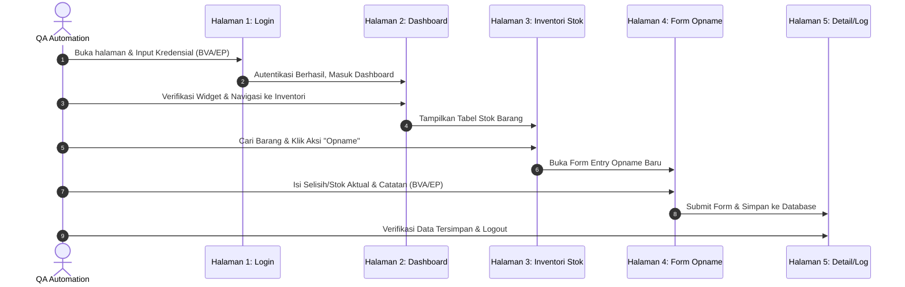

# Rencana Pengujian E2E & Pembagian Tugas Kelompok
## Proyek Akhir Praktikum Pengujian Perangkat Lunak

Dokumen ini adalah acuan resmi perencanaan, pembagian tugas, dan skenario pengujian untuk aplikasi **Auto Service (Manajemen Bengkel & Inventori)**. Pengujian diimplementasikan menggunakan framework modern **Playwright + Cucumber (BDD Gherkin) + Page Object Model (POM)** dengan **Laporan HTML Otomatis**.

---

## 1. Pembagian Tugas Kelompok

Pembagian tugas ini dirancang agar setiap anggota kelompok bertindak sebagai **Automation QA Engineer** dengan kontribusi dalam penulisan spesifikasi skenario (*Gherkin .feature*), perancangan test case (*BVA & EP*), pembuatan *Page Object Model (POM)*, dan penulisan *Step Definitions*.

```
                              [ Semua Anggota Kelompok = Automation QA Engineer ]
                                                      │
       ┌──────────────────────────┬───────────────────┴──────────────┬──────────────────────────┐
       ▼                          ▼                                  ▼                          ▼
   [ Janu  ]                   [ Fahim ]                          [ Akmal ]                  [ Hafidz ]
 ├─ Setup Base & Hook      ├─ Gherkin & Config                ├─ POM & Steps Page 3      ├─ POM & Steps Page 5
 ├─ POM & Steps Page 1     ├─ POM & Steps Page 2              ├─ POM & Steps Page 4 (A)  ├─ POM & Steps Page 4 (B)
 └─ Test Case Page 1       └─ Test Case Page 2                └─ Test Case Page 3 & 4(A) └─ Bug Report & HTML Report
```

### Detail Distribusi Pekerjaan:

#### Janu — *Automation QA Engineer 1*
*   **Tanggung Jawab**:
    *   Menginisialisasi folder framework pengujian (`e2e-testing/` project) dan membuat fondasi base class POM (`BasePage.js`) serta Hooks global.
    *   Merancang test case (BVA/EP) & mengimplementasikan POM dan Step Definitions untuk **Halaman 1 (Auth / Login Page)**.
*   **Target Output File**:
    *   `e2e-testing/page_objects/BasePage.js` & `e2e-testing/support/hooks.js`
    *   `e2e-testing/page_objects/LoginPage.js`
    *   `e2e-testing/step_definitions/auth_steps.js`

#### Fahim — *Automation QA Engineer 2*
*   **Tanggung Jawab**:
    *   Mengonfigurasi berkas integrasi runner (`package.json`, `cucumber.js`) dan menulis spesifikasi skenario BDD Gherkin global (`.feature`).
    *   Merancang test case (BVA/EP) & mengimplementasikan POM dan Step Definitions untuk **Halaman 2 (Dashboard / Home Page)**.
*   **Target Output File**:
    *   `e2e-testing/features/stock_opname_e2e.feature`
    *   `e2e-testing/page_objects/DashboardPage.js`
    *   `e2e-testing/step_definitions/dashboard_steps.js`

#### Akmal — *Automation QA Engineer 3*
*   **Tanggung Jawab**:
    *   Merancang test case (BVA/EP) & mengimplementasikan POM dan Step Definitions untuk **Halaman 3 (Daftar Stok Barang / Inventory Page)** dan **Halaman 4 (Form Stock Opname Page - Input Bagian 1)**.
*   **Target Output File**:
    *   `e2e-testing/page_objects/InventoryPage.js`
    *   `e2e-testing/step_definitions/inventory_steps.js`

#### Hafidz — *Automation QA Engineer 4*
*   **Tanggung Jawab**:
    *   Mengonfigurasi berkas *Automated HTML Report* (`reporter.js`) dan menyusun berkas laporan *bug* (`BUG_REPORTING.md`).
    *   Merancang test case (BVA/EP) & mengimplementasikan POM dan Step Definitions untuk **Halaman 4 (Form Stock Opname Page - Aksi/Submit Bagian 2)** dan **Halaman 5 (Detail/Konfirmasi Opname & Log Activity & Logout)**.
*   **Target Output File**:
    *   `e2e-testing/page_objects/DetailPage.js` & `e2e-testing/page_objects/OpnameFormPage.js`
    *   `e2e-testing/step_definitions/detail_steps.js`
    *   `e2e-testing/support/reporter.js` & `e2e-testing/reports/BUG_REPORTING.md`

---

## 2. Skenario Pengujian End-to-End (5 Halaman Web)

Skenario E2E ini mengikuti perjalanan data barang dari login sistem, pencarian, proses stock opname, hingga pencatatan riwayat transaksi/aktivitas.



### Rincian 5 Halaman yang Diuji:
1.  **Halaman 1 (Login)**: `fe-opname/src/app/auth/sign-in/page.tsx`
    *   *Deskripsi*: Form masuk admin/petugas inventori.
2.  **Halaman 2 (Dashboard)**: `fe-opname/src/app/(dashboard)/page.tsx`
    *   *Deskripsi*: Ringkasan statistik operasional bengkel, total antrean, dan stok kritis.
3.  **Halaman 3 (Inventori - Daftar Stok)**: `fe-opname/src/app/(dashboard)/inventori/stok/page.tsx`
        *   *Deskripsi*: Daftar tabel inventori suku cadang/barang dengan pencarian dan filter.
4.  **Halaman 4 (Form Stock Opname)**: `fe-opname/src/app/(dashboard)/inventori/opname/page.tsx`
    *   *Deskripsi*: Form penyesuaian jumlah fisik barang secara aktual.
5.  **Halaman 5 (Detail/Log Opname)**: `fe-opname/src/app/(dashboard)/inventori/opname/` (halaman tabel riwayat hasil opname yang tersimpan).
    *   *Deskripsi*: Memastikan data opname tersimpan rapi dan sesi dapat diakhiri dengan menekan tombol **Logout** di sidebar/profil.

---

## 3. Rancangan Test Case: BVA & Equivalence Partitioning (EP)

Tabel berikut dirancang khusus menggunakan teknik pengujian fungsional untuk disalin langsung ke spreadsheet kelompok:

### A. Equivalence Partitioning (EP) - Halaman Login

| Test Case ID | Skenario Input | Kelas Ekivalen | Harapan Hasil | Status |
| :--- | :--- | :--- | :--- | :--- |
| **TC-EP-001** | Email: `admin@service.com` (Terdaftar)<br>Password: `password123` (Benar) | **Valid Credentials** | Berhasil masuk ke Halaman Dashboard | [ ] Belum Diuji |
| **TC-EP-002** | Email: `salah@service.com` (Tidak Terdaftar)<br>Password: `password123` | **Invalid Email** | Muncul pesan error "Kredensial tidak cocok" | [x] Lolos (Diuji otomatis oleh Janu) |
| **TC-EP-003** | Email: `admin@service.com`<br>Password: `pass` (Terlalu Pendek / < 8 Karakter) | **Invalid Password (Short)** | Muncul validasi form "Password minimal 8 karakter" | [ ] Belum Diuji |
| **TC-EP-004** | Email: `admin@service.com`<br>Password: `password123456789012345678901` (>20 Karakter) | **Invalid Password (Long)** | Muncul validasi form "Password maksimal 20 karakter" | [ ] Belum Diuji |

### B. Boundary Value Analysis (BVA) - Halaman Form Stock Opname (Input Selisih/Stok Aktual)

*Asumsi sistem: Jumlah fisik barang aktual yang diinput harus berupa angka integer non-negatif dengan batas maksimal kapasitas gudang per barang `9999` unit.*

| Test Case ID | Input Nilai Aktual | Kategori Batas | Harapan Hasil | Status |
| :--- | :--- | :--- | :--- | :--- |
| **TC-BVA-001** | `-1` | Di bawah batas minimum | Form menolak, tombol submit dinonaktifkan / muncul pesan error | [ ] Belum Diuji |
| **TC-BVA-002** | `0` | Nilai batas bawah (Minimum) | Berhasil disubmit, sistem mencatat stok barang menjadi habis (0) | [ ] Belum Diuji |
| **TC-BVA-003** | `1` | Tepat di atas batas bawah | Berhasil disubmit, sistem mencatat stok aktual = 1 | [ ] Belum Diuji |
| **TC-BVA-004** | `9998` | Tepat di bawah batas atas | Berhasil disubmit, sistem mencatat stok aktual = 9998 | [ ] Belum Diuji |
| **TC-BVA-005** | `9999` | Nilai batas atas (Maksimum) | Berhasil disubmit, sistem mencatat stok aktual = 9999 | [ ] Belum Diuji |
| **TC-BVA-006** | `10000` | Di atas batas maksimum | Form menolak, muncul error "Nilai melebihi batas maksimal kapasitas" | [ ] Belum Diuji |

---

## 4. Struktur Folder Framework Pengujian (`e2e-testing/`)

Semua kode pengujian akan diletakkan di dalam folder `/Users/mrfrog/WebstormProjects/pad 2/e2e-testing/` agar rapi dan tidak mengotori kode utama frontend maupun backend.

```text
e2e-testing/
├── features/
│   └── stock_opname_e2e.feature      # Skenario BDD Gherkin
├── page_objects/
│   ├── BasePage.js                   # Class dasar POM
│   ├── LoginPage.js                  # Page Object Login
│   ├── DashboardPage.js              # Page Object Dashboard
│   ├── InventoryPage.js              # Page Object Daftar Stok
│   ├── OpnameFormPage.js             # Page Object Form Opname
│   └── DetailPage.js                 # Page Object Detail & Log
├── step_definitions/
│   ├── auth_steps.js                 # Steps untuk login/logout
│   ├── inventory_steps.js            # Steps untuk daftar stok & form opname
│   └── detail_steps.js               # Steps untuk detail & verifikasi
├── support/
│   ├── hooks.js                      # Setup Playwright & Screenshot on Failure
│   └── reporter.js                   # Konfigurasi Laporan HTML Otomatis
├── reports/                          # Folder output laporan otomatis
│   └── html/                         # Output cucumber-html-reporter
├── package.json                      # Dependensi pengujian
└── cucumber.js                       # Konfigurasi CucumberJS
```

---

## 5. Cara Menjalankan Pengujian & Membuat Laporan

Setelah setup diselesaikan oleh **Janu**, langkah-langkah eksekusi untuk seluruh anggota kelompok adalah:

1.  **Jalankan Aplikasi Web FE & BE**:
    *   Pastikan backend `be-opname` aktif di port `3001` (atau port defaultnya).
    *   Pastikan frontend `fe-opname` aktif di `http://localhost:3333`.
2.  **Jalankan Pengujian**:
    *   Buka terminal di dalam folder `e2e-testing/`
    *   Jalankan perintah:
        ```bash
        npm test
        ```
3.  **Melihat Laporan HTML Otomatis**:
    *   Setelah tes selesai, file laporan interaktif akan dibuat di `e2e-testing/reports/html/cucumber_report.html`.
    *   Laporan ini dapat dibuka langsung di Google Chrome dan menyertakan grafik persentase kelulusan, serta tangkapan layar jika ada langkah pengujian yang gagal (sebagai bahan *Bug Reporting*).
