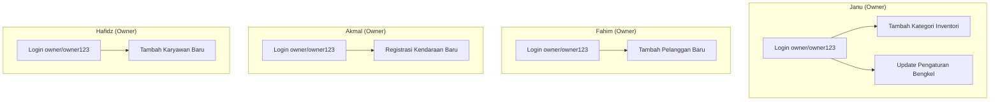

# Rencana Pengujian E2E & Pembagian Tugas Kelompok
## Proyek Akhir Praktikum Pengujian Perangkat Lunak (PPPL)

Dokumen ini adalah acuan resmi perencanaan, pembagian tugas, dan skenario pengujian untuk aplikasi **Auto Service (Manajemen Bengkel & Inventori)**. Pengujian diimplementasikan menggunakan framework **Java Maven + Selenium WebDriver + Cucumber (BDD Gherkin) + Page Object Model (POM)**.

Setiap skenario dirancang untuk diuji secara mandiri dari proses **login `owner/owner123`** hingga verifikasi akhir fitur (full 1 fitur per skenario, 1 file per anggota).

---

## 1. Pembagian Tugas Kelompok (QA Automation Team)

```
           [ Semua Anggota Kelompok = Automation QA Engineer ]
                                     │
         ┌───────────────┬───────────┴────────┬───────────────┐
         ▼               ▼                    ▼               ▼
      [ Janu ]        [ Fahim ]           [ Akmal ]       [ Hafidz ]
  ├─ Fitur 1:      ├─ Fitur 3:         ├─ Fitur 4:     ├─ Fitur 5:
  │  Tambah        │  Tambah           │  Registrasi   │  Tambah
  │  Kategori      │  Pelanggan        │  Kendaraan    │  Karyawan
  └─ Fitur 2:      └─ fahim.feature    └─ akmal.feature└─ hafidz.feature
     Pengaturan
     janu.feature
```

### Detail Distribusi Pekerjaan:

#### Janu — *QA Engineer 1*
*   **Tanggung Jawab**:
    *   Inisialisasi framework POM, konfigurasi driver Selenium, `Hooks.java`, `BasePage.java`.
    *   Merancang & mengimplementasikan POM dan Step Definitions untuk **Fitur Tambah Kategori Inventori** & **Fitur Update Pengaturan Bengkel**.
*   **File Output**:
    *   `BasePage.java`, `LoginPage.java`, `DashboardPage.java`, `Hooks.java`
    *   `KategoriPage.java`, `PengaturanPage.java`
    *   `AuthSteps.java`, `NavigasiSteps.java`, `JanuSteps.java`
    *   `janu.feature`

#### Fahim — *QA Engineer 2*
*   **Tanggung Jawab**:
    *   Mengonfigurasi runner Cucumber JUnit global (`pom.xml`, `TestRunner.java`).
    *   Merancang & mengimplementasikan POM dan Step Definitions untuk **Fitur Tambah Pelanggan Baru**.
*   **File Output**:
    *   `PelangganPage.java`
    *   `FahimSteps.java`
    *   `fahim.feature`
    *   `pom.xml`, `TestRunner.java`

#### Akmal — *QA Engineer 3*
*   **Tanggung Jawab**:
    *   Merancang kasus uji registrasi kendaraan.
    *   Mengimplementasikan POM dan Step Definitions untuk **Fitur Registrasi Kendaraan Baru**.
*   **File Output**:
    *   `KendaraanPage.java`
    *   `AkmalSteps.java`
    *   `akmal.feature`

#### Hafidz — *QA Engineer 4*
*   **Tanggung Jawab**:
    *   Mengonfigurasi automated report runner.
    *   Mengimplementasikan POM dan Step Definitions untuk **Fitur Tambah Karyawan Baru**.
    *   Menyusun laporan bug komprehensif (`bug-reports.md`) dari total 5 fitur yang diuji.
*   **File Output**:
    *   `KaryawanPage.java`
    *   `HafidzSteps.java`
    *   `hafidz.feature`
    *   `bug-reports.md`

---

## 2. Alur & Skenario Pengujian Per Fitur (5 Fitur)

Setiap skenario dimulai dengan login mandiri menggunakan akun `owner / owner123`.



### Rincian Skenario BDD Gherkin:

#### Fitur 1 — Tambah Kategori Inventori (Janu)
*   **URL**: `http://localhost:3333/inventori/kategori`
*   **Alur**: Login Owner → Navigasi ke Kategori → Klik "Tambah Kategori" → Isi nama kategori → Klik "Simpan Kategori" → Verifikasi notifikasi sukses.
*   **File**: `janu.feature` (Scenario: `@janu @kategori`)

#### Fitur 2 — Update Pengaturan Bengkel (Janu)
*   **URL**: `http://localhost:3333/pengaturan`
*   **Alur**: Login Owner → Navigasi ke Pengaturan → Isi nama bengkel, nomor WA, alamat → Klik "Simpan Profil" → Verifikasi notifikasi sukses.
*   **File**: `janu.feature` (Scenario: `@janu @pengaturan`)

#### Fitur 3 — Tambah Pelanggan Baru (Fahim)
*   **URL**: `http://localhost:3333/pelanggan`
*   **Alur**: Login Owner → Navigasi ke Pelanggan → Klik "Tambah Pelanggan" → Isi nama, nomor WA, alamat → Klik "Simpan Pelanggan" → Verifikasi notifikasi sukses.
*   **File**: `fahim.feature` (Scenario: `@fahim @pelanggan`)

#### Fitur 4 — Registrasi Kendaraan Baru (Akmal)
*   **URL**: `http://localhost:3333/kendaraan`
*   **Alur**: Login Owner → Navigasi ke Kendaraan → Klik "Registrasi Baru" → Isi nomor plat, merek, model, tahun, warna → Pilih pemilik dari autocomplete → Klik "Daftarkan Unit" → Verifikasi notifikasi sukses.
*   **File**: `akmal.feature` (Scenario: `@akmal @kendaraan`)

#### Fitur 5 — Tambah Karyawan Baru (Hafidz)
*   **URL**: `http://localhost:3333/karyawan`
*   **Alur**: Login Owner → Navigasi ke Karyawan → Klik "Tambah Karyawan" → Isi nama, username, pilih jabatan (Admin), nomor WA, password → Klik "Simpan Karyawan" → Verifikasi notifikasi sukses.
*   **File**: `hafidz.feature` (Scenario: `@hafidz @karyawan`)

---

## 3. Perintah Eksekusi Test

> **Prasyarat**: Backend (`http://localhost:4001`) dan Frontend (`http://localhost:3333`) harus berjalan.

```bash
cd e2e-testing

# Semua skenario
mvn test

# Per anggota (jalankan dari dalam folder e2e-testing)
mvn test -Dcucumber.filter.tags="@janu"     # Janu  : kategori + pengaturan
mvn test -Dcucumber.filter.tags="@fahim"    # Fahim : pelanggan
mvn test -Dcucumber.filter.tags="@akmal"    # Akmal : kendaraan
mvn test -Dcucumber.filter.tags="@hafidz"   # Hafidz: karyawan
```

Laporan HTML tersedia di: `e2e-testing/target/cucumber-reports/cucumber.html`

---

## 4. Hasil & Laporan Bug (Bug Report)

Laporan bug dikompilasi secara menyeluruh oleh **Hafidz** untuk mendata semua anomali yang ditemukan pada ke-5 skenario pengujian. Laporan disimpan dalam file `e2e-testing/docs/bug-reports.md`.
